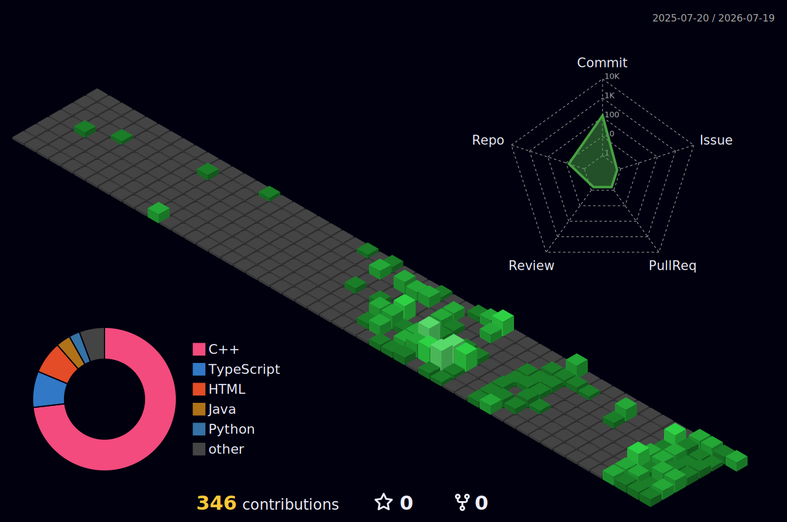

# 🚀 Soham Surve

<h1 align="center">Hi 👋, I'm Soham Surve</h1>

<h3 align="center">
Computer Engineering Student • Cybersecurity Enthusiast • AI Engineer • C++ Developer
</h3>

<p align="center">
I enjoy building scalable software, exploring modern cybersecurity, developing AI-powered systems, and writing high-performance applications in C++. My interests span systems programming, machine learning, distributed systems, cloud infrastructure, and software architecture.
</p>

<p align="center">

</p>

---

# 🌐 Connect With Me

<p align="center">

<a href="https://www.linkedin.com/in/soham-surve-a98606223/">

</a>

<a href="https://instagram.com/Spaceiioloid">

</a>

</p>

---

# 🧠 About Me

* 🎓 Computer Engineering Student
* 🔐 Passionate about Cybersecurity and Secure Systems
* 🤖 Exploring Artificial Intelligence & Machine Learning
* ⚡ Modern C++ Developer
* ☁️ Interested in Distributed Systems & Cloud Computing
* 🐧 Linux Enthusiast
* 📖 Constantly learning new technologies
* 🚀 Building software that is scalable, reliable, and efficient

---

# ⚡ Current Interests

```text
🛡️ Cybersecurity
███████████████████████ 100%

🤖 Artificial Intelligence
█████████████████████░░ 90%

⚙️ Modern C++
████████████████████░░░ 85%

☁️ Distributed Systems
██████████████████░░░░░ 80%

🐧 Linux
█████████████████░░░░░░ 75%

🧩 Data Structures & Algorithms
█████████████████░░░░░░ 75%
```

---

# 💻 Languages


---

# 🛠 Frameworks & Libraries


---

# ⚙️ Tools & Platforms


---

# 📊 GitHub Statistics


---

# 🐍 3D Contribution Graph

<p align="center">

</p>

---

<p align="center">

> *"Great software isn't just built to work — it's built to endure."*

</p>
